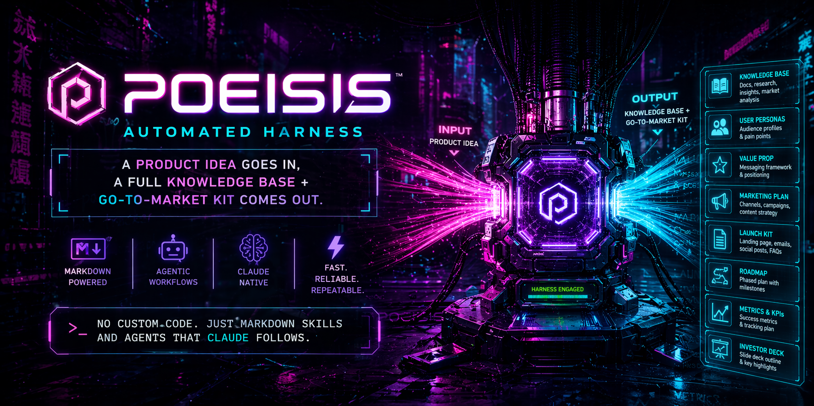

<p align="center">
  
</p>

<h3 align="center">A product idea goes in. A full knowledge base + go-to-market kit comes out.</h3>

<p align="center">
  No custom code. Just markdown skills and agents that Claude follows.<br/>
  <strong>Markdown-powered</strong> · <strong>Agentic workflows</strong> · <strong>Claude-native</strong>
</p>

---

## What is Poiesis?

Poiesis is a **Claude Code plugin** that automates the entire journey from a raw product idea to a complete go-to-market package. It orchestrates specialized AI agents across three phases — research, strategy, and GTM execution — producing real, usable artifacts at every step.

You provide an idea. Poiesis delivers:

- A **research knowledge base** with market analysis, competitor profiles, pain-point evidence, public data sources, and opportunity mapping
- A **strategy viability report** with a binary GO/NO-GO verdict, defensibility analysis, monetization models, and ICP definition
- A **GTM kit** including a working Next.js prototype, a Remotion promo video, and a full marketing asset suite (copy, social content, launch plan, sales materials, cold outreach)

Everything is generated by specialized agents running in parallel, with quality gates between each phase. If the idea isn't viable, the pipeline stops early and tells you why.

## Why Poiesis?

| | Traditional approach | With Poiesis |
|---|---|---|
| **Market research** | Days of manual Googling and spreadsheets | 7 specialists run in parallel, cite real sources |
| **Viability assessment** | Gut feeling or expensive consultants | Data-driven GO/NO-GO with moat analysis |
| **Prototype** | Weeks of design + dev cycles | Static HTML prototype with GSAP, Three.js, scroll animations — opens in browser, no build step |
| **Promo video** | Agency engagement, $5K+ budget | Remotion-rendered mp4, reviewed with ffprobe |
| **Marketing assets** | Copywriter + social manager + strategist | 5 specialists + 3 derived assets in one pass |
| **Total time** | 4-8 weeks | 30-60 minutes |

## Pipeline overview

```
                    IDEA
                      |
          +-----------+-----------+
          |     Phase 1: RESEARCH |
          |    7 specialists (||) |
          |    → knowledge base   |
          +-----------+-----------+
                      |
                  [QA Gate]
                      |
          +-----------+-----------+
          |    Phase 2: STRATEGY  |
          |   5 specialists (||)  |
          |   → GO / NO-GO       |
          +-----------+-----------+
                      |
              NO-GO? STOP + report
                      |
                     GO
                      |
          +-----------+-----------+
          |     Phase 3: GTM      |
          |                       |
          |  Design (sequential)  |
          |    2 designers → 1    |
          |    consolidated       |
          |    prototype          |
          |         |             |
          |   Video || Marketing  |
          |  (parallel)           |
          |         |             |
          |  → FINAL_REPORT.md   |
          +-----------------------+
```

## What you get

### Phase 1 — Research (8 artifacts)

| File | What it contains |
|---|---|
| `01-market.md` | Industry overview, trends, adoption stage, key players |
| `02-legal-industry.md` | Regulatory landscape, data/privacy rules, licensing |
| `03-public-data.md` | Datasets, public APIs, scraping sources |
| `04-pain-points.md` | Real user pain evidence with source URLs |
| `05-competitors.md` | 3-7 direct competitors profiled with URLs |
| `06-opportunities.md` | 3+ business opportunities tied to research evidence |
| `07-idea-variants.md` | 3+ idea variants scored on fit/moat/monetization/effort |
| `index.md` | Consolidated summary with gap analysis |

### Phase 2 — Strategy (6 artifacts)

| File | What it contains |
|---|---|
| `01-competitors-deep-dive.md` | Positioning, differentiators, weaknesses, channels |
| `02-legal-country.md` | Country-specific regulatory requirements |
| `03-moat-barriers.md` | Defensibility analysis, replication timeline |
| `04-monetization.md` | 2-3 models with unit economics sketches |
| `05-icp-b2b-b2c.md` | B2B/B2C classification, primary ICP, intent signals |
| `viability-report.md` | **VERDICT: GO/NO-GO** + winning variant + risks + rationale |

### Phase 3 — GTM (12+ artifacts)

| Sub-team | Artifacts |
|---|---|
| **Design** | `ui-ux-brief.md`, static HTML `prototype/` (GSAP + Three.js + scroll animations), Playwright `screenshots/` |
| **Video** | Remotion `remotion-project/`, rendered `promo.mp4`, sampled `frames/` |
| **Marketing** | `copywriting.md`, `social-content.md`, `launch-strategy.md`, `sales-enablement.md`, `cold-email.md`, `icp-detailed.md`, `channels.md`, `search-queries.md` |
| **Director** | `FINAL_REPORT.md` — executive summary + next steps |

## Installation

```bash
git clone https://github.com/nicoache1/poiesis.git
cd poiesis
bash install.sh
```

The installer will ask you to choose:
- **Project scope** — installs into a specific project's `.claude/` directory
- **User scope** — installs globally into `~/.claude/` (available in all sessions)

## Dependencies

### Claude Code Skills (install separately)

| Skill | Purpose | Used in |
|---|---|---|
| [ARIS](https://github.com/mattshen/aris) (`/research-lit`) | Academic literature search | Research |
| [marketingskills](https://github.com/mackstann/marketingskills) | Marketing suite: `/competitor-profiling`, `/competitor-alternatives`, `/pricing-strategy`, `/customer-research`, `/copywriting`, `/social-content`, `/launch-strategy`, `/sales-enablement`, `/cold-email` | Research, Strategy, GTM |
| [ui-ux-pro-max](https://github.com/nextlevelbuilder/ui-ux-pro-max-skill) | UI/UX design briefs | GTM Design |
| [frontend-design](https://github.com/anthropics/skills/tree/main/skills/frontend-design) | HTML prototype generation with animations | GTM Design |
| [remotion-best-practices](https://github.com/remotion-dev/skills) | Video generation with Remotion | GTM Video |
| [Codex](https://github.com/openai/codex-plugin-cc) (`/codex:adversarial-review`) | Adversarial QA gate between phases | All phases |

### External Tools

| Tool | Purpose | Install |
|---|---|---|
| [markitdown](https://github.com/microsoft/markitdown) | Web page content extraction to markdown | `npm install -g markitdown` |
| [Playwright](https://playwright.dev/) | Prototype screenshot capture | `npx playwright install chromium` |
| [Chromium](https://www.chromium.org/) | Fallback screenshot capture | Via Playwright or system package |
| [ffmpeg](https://ffmpeg.org/) | Video frame sampling | `brew install ffmpeg` |
| [ffprobe](https://ffmpeg.org/) | Video duration verification | Included with ffmpeg |

> **Note:** For web research, agents use Claude's built-in WebSearch and WebFetch tools — no API keys needed.

## Usage

Start a Claude Code session and run:

```
/poiesis
```

Poiesis will ask for:
1. **Idea title** — short name for your product
2. **Idea description** — what it does, who it's for
3. **Language** — `en` or `es` (all output in that language)

Then it runs the full pipeline autonomously. Each phase has binary quality gates with up to 3 retries.

## Project structure

```
poiesis/
  .claude-plugin/plugin.json       # Plugin manifest
  skills/poiesis/SKILL.md          # Main orchestrator — invoke as /poiesis
  agents/
    research-director.md           # Phase 1: spawns 7 research specialists
    strategy-director.md           # Phase 2: spawns 5 strategy specialists
    gtm-director.md                # Phase 3: design → video || marketing
    references/
      gates.md                    # Binary quality gates for all phases
  install.sh                       # Interactive installer
```

## How it works

Poiesis is built entirely with **markdown instructions** — no TypeScript, no Python, no custom runtime. It leverages Claude Code's native capabilities:

- **Skills** (`SKILL.md`) define the orchestration flow
- **Agents** (`.md` files) are spawned as subagents with specific roles
- **Quality gates** are binary checklists that Claude verifies between phases
- **Parallel execution** happens naturally through Claude's Agent tool

Each specialist agent is told which skills to use (exa-search, competitor-profiling, etc.), ensuring outputs are grounded in real data rather than hallucinated.

## License

MIT
